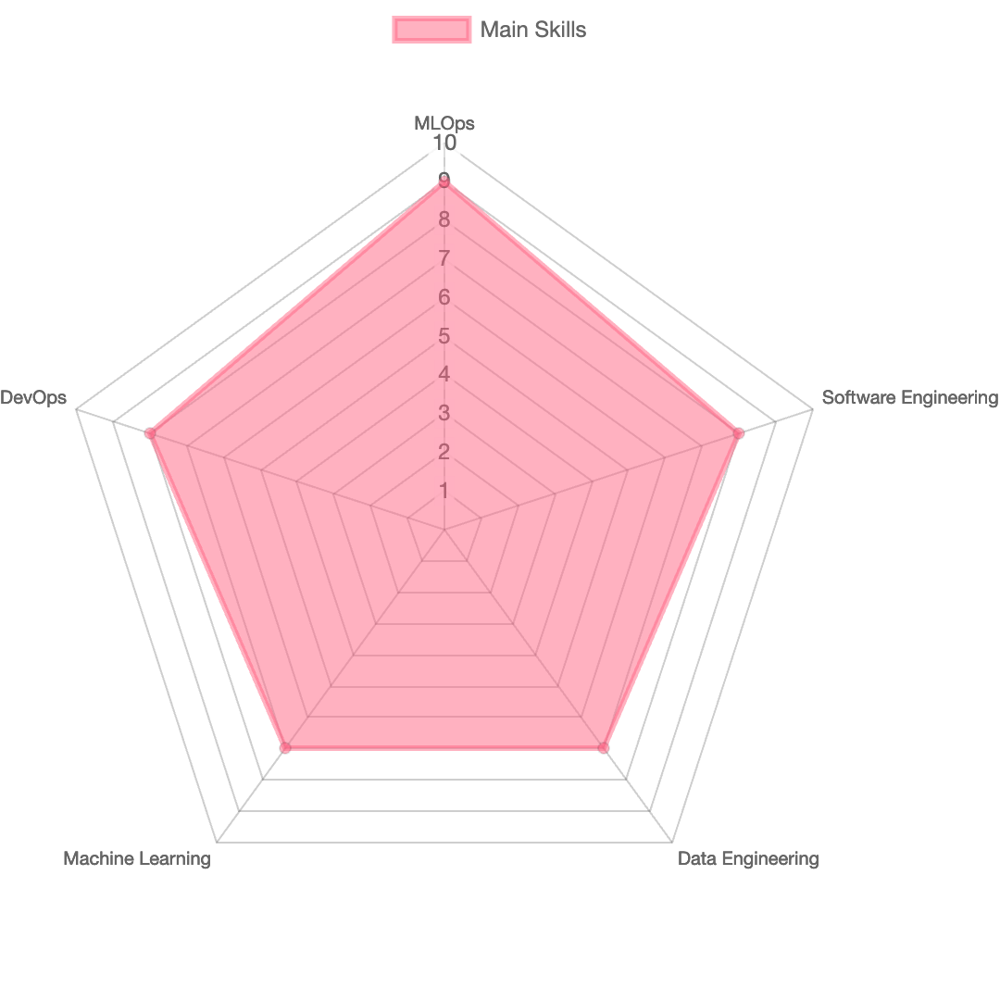

## Hi there 👋

A little bit about myself...

:green_circle: 7 years of experience in IT 
:yellow_circle: Machine Learning Engineer 
:large_blue_circle: MBA in Data Science & Artificial Inteligence at [FIAP](https://www.fiap.com.br/mba/mba-em-data-science-artificial-intelligence/) 
:purple_circle: B.Sc. in Automation and Control Engineering at [FEI](https://portal.fei.edu.br/engenharia-de-automacao-e-controle) 

I'm intersted in Machine Learning and Data Science, specially the challenges related to deploy and mantain the ML algorithms at scale. I have strong experience in Software Engineering, Data Engineering and MLOps

### Main Skills/Tools & Interests
🟩 Machine Learning Algorithms 
🟪 MLOps 
🟧 ML end to end (Data Acquisition, transformation, model training, monitoring, automatic retraining, drift detection) 
🟨 Programming Languages: Python, Java, Kotlin, C/C++ 
🟥 AWS (S3, IAM, ECS, EKS, Sagemaker, EC2, Lambda, Redshift, Kinesis) 
🟦 Kafka, Kafka Streaming, Kafka Connect 
🟫 Docker, Terraform, Kubernetes, CI/CD 
⬜ Postgres, MySQL, RDS, CassandraDB

  

### Projects
🔷 Machine Learning algorithms implemented from scratch: [mlkit](https://github.com/andre1393/mlkit) 
🔶 Serving a ML model API using the best practices: [fashion-mnist](https://github.com/andre1393/fashion-mnist) 
🔷 Service API to apply noise reduction to audios: [noise-reduction](https://github.com/andre1393/noise-reduction)

### Blog Articles/Presentations
[ [PT-BR] Python Brasil 2022 - Terminei a modelage, e agora? feat Vivian Yamassaki](https://youtu.be/faXgMxy6NUw) 
[ [PT-BR] Nossos primeiros passos para escalar a produção de modelos de Data Science](https://medium.com/creditas-tech/nossos-primeiros-passos-para-escalar-a-produ%C3%A7%C3%A3o-de-modelos-de-data-science-b43ba330e935) 
[ [PT-BR] Terminei a modelagem, e agora? — Parte II](https://medium.com/creditas-tech/terminei-a-modelagem-e-agora-parte-ii-8fb75280bdc6) 
  
### Contact
[<image src="https://cdn-icons-png.flaticon.com/512/174/174857.png" width="20"> andreoliveiradasilva](https://www.linkedin.com/in/andreoliveiradasilva/)  
